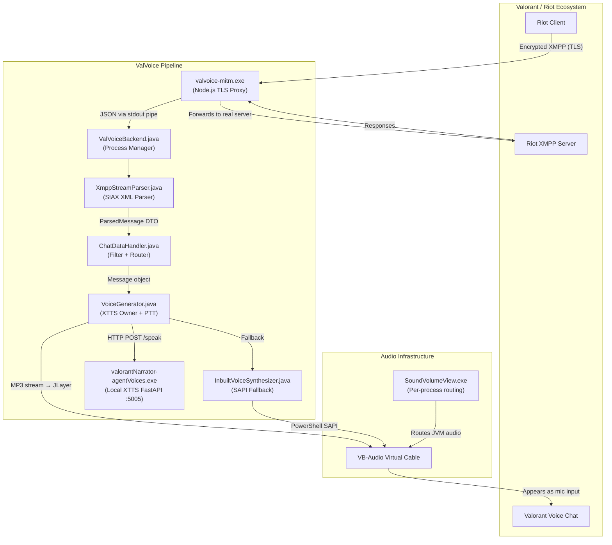
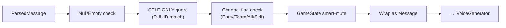
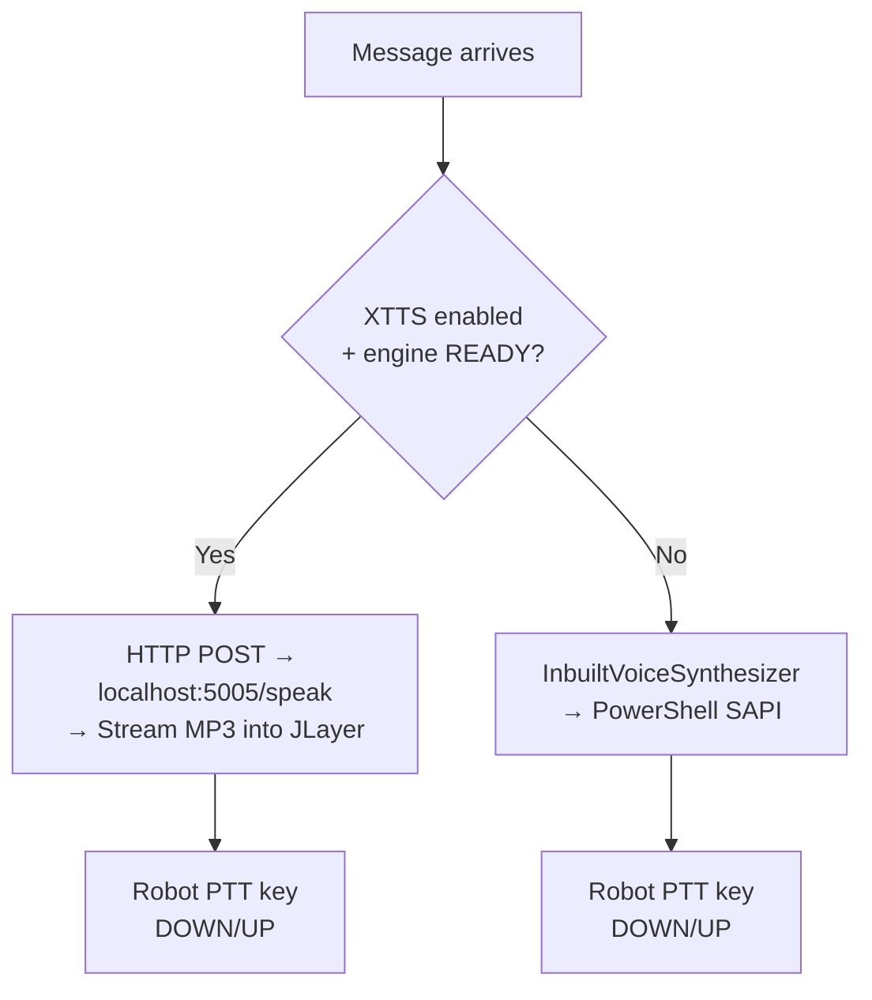
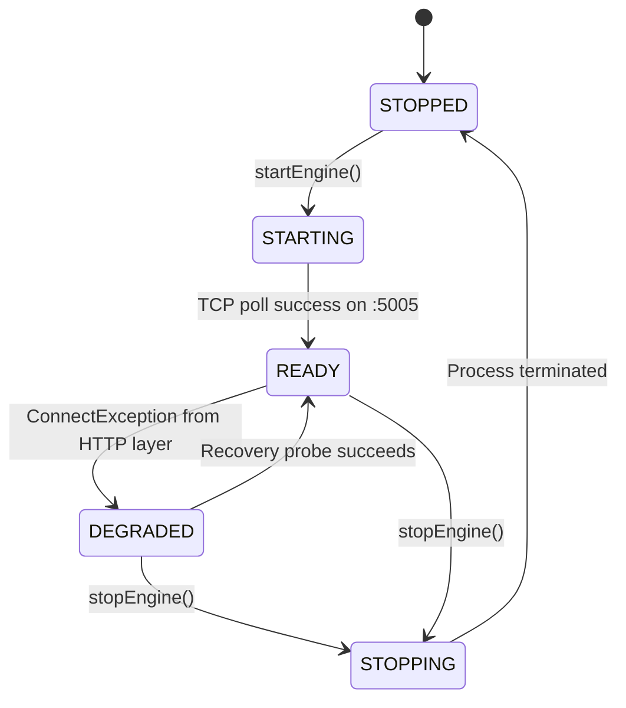
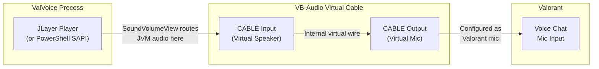
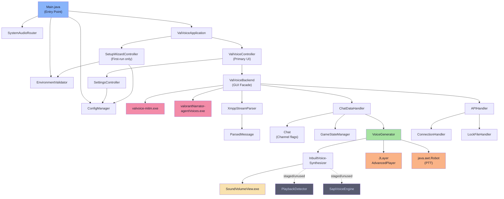

# ValVoice — Complete TTS Architecture Walkthrough

> A detailed explanation of how ValVoice converts Valorant in-game chat messages into speech that teammates hear through voice chat.

---

## 1. What is ValVoice?

ValVoice is a **Windows-only desktop application** that acts as a real-time **Text-to-Speech voice injector** for Valorant. When **you** type a message in Valorant's in-game chat, ValVoice:

1. **Intercepts** the XMPP chat traffic between the Riot Client and Riot's servers
2. **Filters** to only narrate messages sent by the **local user** (teammates' messages are hard-dropped)
3. **Synthesizes speech** using either an AI voice engine (XTTS) or Windows SAPI
4. **Routes the audio** through a virtual cable into Valorant's voice chat input
5. **Simulates push-to-talk** so teammates hear your typed messages as spoken audio

> [!IMPORTANT]
> ValVoice is a **self-only voice injector**. It only narrates messages you send — teammates' messages and whispers are explicitly filtered out in `ChatDataHandler.java`. This is a core invariant.

---

## 2. High-Level Architecture



---

## 3. The Pipeline — Step by Step

### Step 0: Startup Sequence

Before any TTS happens, ValVoice goes through a rigorous boot sequence:

| Order | Action | File | Purpose |
|-------|--------|------|---------|
| 0a | Check for running Riot/Valorant | `Main.java` | MITM must start **before** Riot Client |
| 0b | Kill orphaned processes | `Main.java` | Reaper cleans up stale `mitm.exe` / engine instances |
| 0c | Acquire file lock | `Main.java` | Single-instance enforcement |
| 0d | Environment diagnostics | `EnvironmentValidator.java` | Checks SoundVolumeView, PowerShell, VB-Cable |
| 0e | Route JVM audio → VB-Cable | `SystemAudioRouter.java` | Calls `SoundVolumeView.exe /SetAppDefault` for the **current Java PID** |
| 0f | Load config | `ConfigManager.java` | Reads `%LOCALAPPDATA%\ValVoice\config.json` |
| 0g | Launch JavaFX | `ValVoiceApplication.java` | Loads the GUI |
| 0h | First-run wizard (if needed) | `SetupWizardController.java` | 4-page onboarding: Welcome → Env Check → Audio Setup → Finish |
| 0i | Start backend | `ValVoiceController.java` | Launches MITM proxy + XTTS engine |

> [!IMPORTANT]
> ValVoice **must** start before Valorant/Riot Client. The MITM proxy needs to be listening before the Riot Client attempts to connect to chat servers.

---

### Step 1: XMPP Traffic Interception (MITM Proxy)

**File:** `mitm/src/main.ts` → compiled to `valvoice-mitm.exe`

Valorant's chat system uses **XMPP over TLS** (port 5223). ValVoice intercepts this using a two-stage MITM architecture:

#### Stage A — Config Hijack (`ConfigMITM.ts`)

```
Normal flow:    Riot Client → fetches config from Riot servers → connects to chat.si.riotgames.com:5223
Hijacked flow:  Riot Client → fetches config from localhost:35479 → connects to 127.0.0.1:35478
```

The MITM launches the Riot Client with a **custom config URL** pointing to `localhost:35479`. When Riot requests its config, `ConfigMITM.ts` rewrites the response:

| Field | Original | Rewritten |
|-------|----------|-----------|
| `chat.host` | `jp1.chat.si.riotgames.com` | `127.0.0.1` |
| `chat.port` | `5223` | `35478` |
| `chat.allow_bad_cert.enabled` | `false` | `true` |

This forces the Riot Client to connect to the local TLS proxy instead of the real server.

#### Stage B — TLS Proxy (`XmppMITM.ts`)

The `XmppMITM` proxy on port **35478**:
1. **Terminates TLS** from the Riot Client using self-signed certs (`mitm/certs/`)
2. **Reads the decrypted XMPP XML** in plaintext
3. **Re-encrypts and forwards** to the real Riot XMPP server
4. **Outputs JSON to stdout** for the Java backend to consume

```json
{"type":"incoming","time":1234567890,"data":"<message to='user@jp1'>Hello team!</message>"}
{"type":"outgoing","time":1234567890,"data":"<iq type='get'>...</iq>"}
```

> [!NOTE]
> The MITM is **intentionally thin** — it does zero XML parsing. It simply wraps raw XML in JSON envelopes and writes them to stdout. All intelligence lives in the Java backend.

---

### Step 2: JSON Ingestion (ValVoiceBackend)

**File:** [ValVoiceBackend.java](file:///c:/Users/HP/IdeaProjects/ValVoice/src/main/java/com/someone/valvoicegui/ValVoiceBackend.java)

The GUI-package `ValVoiceBackend.java` acts as the **central orchestrator**:

1. Launches `valvoice-mitm.exe` via `ProcessBuilder`
2. Reads JSON lines from the process's **stdout** via `BufferedReader`
3. Extracts the raw XML string from `"data"` field
4. Passes it to `XmppStreamParser`

The MITM process itself is tracked via **boolean flags and process state** (`mitmProcess.isAlive()`, `mitmFatalError`), not a formal state machine enum.

The **XTTS engine** has a proper state machine via the `EngineState` enum:
```
STOPPED → STARTING → READY → DEGRADED → STOPPING
```

---

### Step 3: XML Parsing (XmppStreamParser)

**File:** [XmppStreamParser.java](file:///c:/Users/HP/IdeaProjects/ValVoice/src/main/java/com/someone/valvoicebackend/XmppStreamParser.java)

Uses **StAX (Streaming API for XML)** — a pull-parser from `javax.xml.stream` — for incremental, memory-efficient parsing:

- Extracts: **message body**, **sender JID**, **channel/MUC room**, **timestamp**, **stanza type**
- Discards malformed XML **silently** (never crashes the pipeline)
- Returns a `ParsedMessage` DTO (immutable data transfer object)

```java
// ParsedMessage fields:
String messageText;    // "Hello team!"
String senderJid;      // "user123@jp1.chat.si.riotgames.com"
String channelId;      // MUC room identifier
String timestamp;      // ISO timestamp
```

---

### Step 4: Message Filtering (ChatDataHandler)

**File:** [ChatDataHandler.java](file:///c:/Users/HP/IdeaProjects/ValVoice/src/main/java/com/someone/valvoicebackend/ChatDataHandler.java)

Acts as a **middleware filter chain** with multiple validation gates. The most critical gate is the **self-only narration guard** — only messages from the local user's PUUID are narrated:



| Gate | Purpose | Controlled by |
|------|---------|---------------|
| Null/Empty | Drops empty or null messages | Hardcoded |
| **Self-only** | **Only narrates messages from local user** (teammates hard-dropped) | PUUID identity match |
| Channel flags | Only pass channels the user has enabled | `Chat.java` (UI checkboxes) |
| Smart-mute | Suppresses TTS during certain game states | `GameStateManager.java` |

`Chat.java` holds boolean flags toggled by UI checkboxes (additive tiers):
- `self` — Read your own messages in the given channel
- `party` — Include party chat
- `team` — Include team chat
- `all` — Include all chat

> [!NOTE]
> Whisper messages are hard-dropped and never narrated.

`GameStateManager.java` tracks game state from XMPP presence stanzas (`sessionLoopState`):
```
MENUS → PREGAME → INGAME
```
When **Clutch Mode** is enabled and state is `INGAME`, narration is suppressed.

---

### Step 5: Speech Routing Decision (VoiceGenerator)

**File:** [VoiceGenerator.java](file:///c:/Users/HP/IdeaProjects/ValVoice/src/main/java/com/someone/valvoicebackend/VoiceGenerator.java)

This is the **TTS command center**. It receives `Message` objects and decides how to synthesize speech:



#### Primary Path: XTTS (AI Voices)

1. Builds an HTTP POST request to `http://127.0.0.1:5005/speak`
2. Request payload includes: **text**, **voice** (agent name like "jett"), **language** ("en")
3. Uses `HttpResponse.BodyHandlers.ofInputStream()` for **streaming** — no temp files
4. Pipes the MP3 byte stream **directly** into JLayer's `AdvancedPlayer`
5. `CustomPlaybackListener` wraps `java.awt.Robot` to handle PTT:
   - `playbackStarted()` → presses configured PTT key
   - `playbackFinished()` → releases configured PTT key

#### Fallback Path: Windows SAPI

When XTTS is disabled or the engine is in `DEGRADED` state:
1. Routes to `InbuiltVoiceSynthesizer.speakInbuiltVoice()`
2. Uses a persistent PowerShell process running `System.Speech.Synthesis.SpeechSynthesizer`
3. Text is sanitized via `escapePowerShellString()` (single-quote escaping) before being passed to PowerShell

> [!TIP]
> The XTTS path **never** writes temporary `.mp3` files to disk. Audio streams directly from the HTTP response into JLayer's decoder in memory. This eliminates disk I/O latency and keeps playback near-instant.

---

### Step 6: The XTTS Engine (valorantNarrator-agentVoices.exe)

**Location:** `engine/valorantNarrator-agentVoices.exe`

This is a **self-contained Python application** (packaged via PyInstaller) running a **FastAPI server** on `127.0.0.1:5005`. It uses the **XTTS (Cross-Language Text-to-Speech)** deep learning model.

| Component | Detail |
|-----------|--------|
| Runtime | Embedded Python 3.11 |
| Framework | FastAPI |
| Port | 5005 (localhost only) |
| Model | XTTS v2 |
| Voice references | `engine/agents/*.mp3` (e.g., `jett.mp3`, `sage.mp3`) |
| Output format | Streaming MP3 |
| Size | ~358 MB (includes Python, CUDA/CPU libs, model weights) |

#### How voice cloning works:
- Each Valorant agent has a short **reference audio clip** (e.g., `jett.mp3`)
- XTTS uses this clip to **clone the voice characteristics**
- New text is spoken in that agent's voice style
- The result streams back as MP3 audio

#### Engine Lifecycle (managed by `ValVoiceBackend.java`):



- **Start:** `ProcessBuilder` launches the EXE with `redirectErrorStream(true)`, no `inheritIO()`
- **Health poll:** TCP socket poll on `127.0.0.1:5005` every 500ms, **300s (5 min) timeout** — the XTTS engine typically takes approximately 90–100 seconds to cold-boot
- **Stop:** Escalation kill — `destroy()` → 500ms wait → `destroyForcibly()` → `taskkill /F /IM`
- **Recovery from DEGRADED:** `setEngineReady()` can be called externally to transition `DEGRADED → READY` and reset restart attempts
- **Crash restart:** Daemon watcher thread detects unexpected exit → attempts one restart (`MAX_RESTART_ATTEMPTS=1`)

---

### Step 7: The SAPI Fallback System

When XTTS is unavailable, ValVoice has a **two-tier fallback**:

#### Tier 1: Direct PowerShell SAPI (Active Fallback)
**File:** [InbuiltVoiceSynthesizer.java](file:///c:/Users/HP/IdeaProjects/ValVoice/src/main/java/com/someone/valvoicebackend/InbuiltVoiceSynthesizer.java)

- Maintains a **persistent PowerShell process** running `System.Speech.Synthesis.SpeechSynthesizer`
- Text is sanitized via `escapePowerShellString()` (single-quote escaping), then sent to the PowerShell process
- No intermediate `.wav` files — speech goes directly to the audio output
- TTS queueing is handled by `VoiceGenerator`'s **single-threaded `ExecutorService`** which ensures strict FIFO ordering with no overlapping speech

#### Tier 2: WAV File Cache (Staged — Not Active)
**File:** [SapiVoiceEngine.java](file:///c:/Users/HP/IdeaProjects/ValVoice/src/main/java/com/someone/valvoicebackend/SapiVoiceEngine.java)

- Generates `.wav` files via one-shot PowerShell commands
- MD5-hashed filenames for caching (`sapi_<hash>.wav`)
- Cache stored at `%LOCALAPPDATA%\ValVoice\cache\`
- Rate limited: 250ms minimum between spawns
- Currently **staged/unused** in the active runtime

---

### Step 8: Push-to-Talk (PTT) Simulation

**Active mechanism:** `java.awt.Robot` inside `VoiceGenerator.java`

For Valorant to transmit the TTS audio to teammates, the PTT key must be held down during playback:

```
┌─────────────────────────────────────────────────────┐
│ playbackStarted() → Robot.keyPress(pttKey)          │
│                                                     │
│   ████████ Audio streaming through JLayer ████████  │
│                                                     │
│ playbackFinished() → Robot.keyRelease(pttKey)       │
└─────────────────────────────────────────────────────┘
```

- `CustomPlaybackListener` extends JLayer's `PlaybackListener`
- PTT key is configurable via Settings UI (default: `V`)
- An `AtomicBoolean` stuck-key guard prevents PTT from getting stuck if playback crashes
- Shutdown hook forces key release as a failsafe

> [!NOTE]
> PTT simulation uses `java.awt.Robot` exclusively. There is no native `SendInput` path in the codebase.

---

### Step 9: Audio Routing (The VB-Cable Trick)

This is the critical piece that makes teammates actually **hear** the TTS:



#### How it works:

1. **At startup**, `SystemAudioRouter.routeApplicationAudio()` calls `SoundVolumeView.exe` to route the **current Java PID's** audio output to **CABLE Input** (the virtual speaker end of VB-Cable):
      ```
   SoundVolumeView.exe /SetAppDefault "CABLE Input" all <current-java-pid>
   SoundVolumeView.exe /SetPlaybackThroughDevice "CABLE Output" "Default Playback Device"
   SoundVolumeView.exe /SetListenToThisDevice "CABLE Output" "1"
   SoundVolumeView.exe /unmute "CABLE Output"
   ```

2. **VB-Cable** internally connects CABLE Input → CABLE Output (like a virtual audio wire)

3. **Valorant** is configured to use **CABLE Output** as its microphone input device

4. **Automated Valorant config:** After Riot authentication, `SystemAudioRouter.java` extracts the VB-Cable hardware GUID and **injects** it into Valorant's `RiotUserSettings.ini`:
   ```ini
   EAresStringSettingName::VoiceDeviceCaptureHandle="{VB-Cable GUID}"
   ```

> [!IMPORTANT]
> Java's built-in `Mixer` API **cannot** do per-process audio routing on Windows. `SoundVolumeView.exe` is an external CLI tool that manipulates the Windows audio mixer at the OS level, which is the only way to route a specific process's audio to a specific device.

---

### Step 10: What Teammates Experience

```
You type: "enemy on A site"
     ↓
ValVoice intercepts the XMPP message
     ↓
XTTS synthesizes it in Jett's voice
     ↓
Audio streams through VB-Cable
     ↓
PTT key is auto-pressed
     ↓
Teammates hear: "enemy on A site" (in Jett's voice)
```

The entire pipeline runs in **under a second** for XTTS, making it feel nearly real-time.

---

## 4. Component Dependency Map



> [!NOTE]
> Greyed-out nodes (`PlaybackDetector`, `SapiVoiceEngine`) are **staged/unused** — they exist in the codebase but are not called by any active runtime path.

---

## 5. Configuration System

### Config File Location
```
%LOCALAPPDATA%\ValVoice\config.json
```

### Config Fields

| Field | Type | Default | Purpose |
|-------|------|---------|---------|
| `pttKey` | String | `"V"` | Push-to-talk key |
| `xttsEnabled` | boolean | `true` | Enable AI voice engine |
| `sapiFallbackEnabled` | boolean | `true` | Enable Windows SAPI fallback |
| `playbackVolume` | double | `1.0` | Volume (0.0–1.0) — *exists in config but not actively applied by XTTS/JLayer or SAPI playback paths* |
| `language` | String | `"en"` | TTS language code |
| `firstRunCompleted` | boolean | `false` | Tracks first-run wizard completion |

### Config Architecture
- **`ValVoiceConfig.java`** — Plain POJO with public fields, serialized by Gson
- **`ConfigManager.java`** — Singleton manager with atomic writes (`.tmp` → `ATOMIC_MOVE`)
- **Runtime reads:** Components call `ConfigManager.get()` dynamically (no restart needed)
- **Settings UI:** `SettingsController.java` provides a GUI for editing all fields

---

## 6. Security Model

| Protection | Implementation |
|------------|----------------|
| **Localhost only** | MITM proxy binds to `127.0.0.1` — no network exposure |
| **No game injection** | Zero interaction with Valorant's process memory or DLLs |
| **No remote API keys** | All API calls target `localhost` only |
| **Safe XML parsing** | StAX parser — malformed packets silently discarded |
| **SSL bypass scoped** | Certificate trust bypass limited to `127.0.0.1` |
| **No credential logging** | API tokens never written to logs |
| **Injection prevention** | XTTS JSON serialized safely via Gson. Staged `SapiVoiceEngine` uses Base64 for PowerShell text. Active `InbuiltVoiceSynthesizer` uses escaped PowerShell strings via `escapePowerShellString()` |
| **Process cleanup** | Shutdown hooks + reaper kill orphaned processes |

---

## 7. Error Recovery & Resilience

### Engine Crash Recovery
```
Engine crash detected (non-zero exit code)
    ↓
Daemon watcher fires handleProcessCrash()
    ↓
stopEngine() + startEngine() (max 1 attempt)
    ↓
Success → READY | Failure → permanent DEGRADED
```

### DEGRADED State Behavior
- TTS routes to **SAPI fallback** immediately
- `setEngineReady()` can restore state to `READY` if engine recovers (called externally)
- Crash watcher attempts one automatic restart; if it fails → permanent `DEGRADED`

### TTS Queue Architecture
- `VoiceGenerator` uses a **single-threaded `ExecutorService`** (`Executors.newSingleThreadExecutor()`) for strict FIFO ordering
- Each narration request is submitted as a task — no overlapping speech
- Daemon thread ensures the executor does not prevent JVM shutdown

---

## 8. Summary: End-to-End Flow

```
 ┌──────────────────────────────────────────────────────────────────┐
 │                        COMPLETE PIPELINE                         │
 ├──────────────────────────────────────────────────────────────────┤
 │                                                                  │
 │  1. Riot Client ──TLS──► valvoice-mitm.exe (TLS termination)    │
 │                                                                  │
 │  2. mitm.exe ──JSON/stdout──► ValVoiceBackend.java              │
 │                                                                  │
 │  3. Backend ──raw XML──► XmppStreamParser (StAX) → ParsedMessage │
 │                                                                  │
 │  4. ParsedMessage ──► ChatDataHandler (filter chain) → Message   │
 │                                                                  │
 │  5. Message ──► VoiceGenerator (routing decision)                │
 │     ├── XTTS path: HTTP POST → :5005/speak → MP3 InputStream   │
 │     └── SAPI path: Persistent PowerShell SpeechSynthesizer      │
 │                                                                  │
 │  6. Audio plays via JLayer / PowerShell                          │
 │     PTT key pressed by java.awt.Robot                           │
 │                                                                  │
 │  7. SoundVolumeView routes JVM audio → VB-Cable Input           │
 │                                                                  │
 │  8. VB-Cable Input → VB-Cable Output (virtual wire)             │
 │                                                                  │
 │  9. Valorant reads VB-Cable Output as microphone                │
 │                                                                  │
 │ 10. Teammates hear TTS in voice chat 🔊                         │
 │                                                                  │
 └──────────────────────────────────────────────────────────────────┘
```

---

## Source Files Reference

| File | Package | Role |
|------|---------|------|
| [Main.java](file:///c:/Users/HP/IdeaProjects/ValVoice/src/main/java/com/someone/valvoicegui/Main.java) | `valvoicegui` | Entry point, startup orchestrator |
| [ValVoiceApplication.java](file:///c:/Users/HP/IdeaProjects/ValVoice/src/main/java/com/someone/valvoicegui/ValVoiceApplication.java) | `valvoicegui` | JavaFX bootstrap + wizard routing |
| [ValVoiceController.java](file:///c:/Users/HP/IdeaProjects/ValVoice/src/main/java/com/someone/valvoicegui/ValVoiceController.java) | `valvoicegui` | Primary UI controller |
| [ValVoiceBackend.java](file:///c:/Users/HP/IdeaProjects/ValVoice/src/main/java/com/someone/valvoicegui/ValVoiceBackend.java) | `valvoicegui` | Facade + engine lifecycle |
| [XmppStreamParser.java](file:///c:/Users/HP/IdeaProjects/ValVoice/src/main/java/com/someone/valvoicebackend/XmppStreamParser.java) | `valvoicebackend` | StAX XML parser |
| [ChatDataHandler.java](file:///c:/Users/HP/IdeaProjects/ValVoice/src/main/java/com/someone/valvoicebackend/ChatDataHandler.java) | `valvoicebackend` | Message filter + router |
| [VoiceGenerator.java](file:///c:/Users/HP/IdeaProjects/ValVoice/src/main/java/com/someone/valvoicebackend/VoiceGenerator.java) | `valvoicebackend` | XTTS owner + PTT controller |
| [InbuiltVoiceSynthesizer.java](file:///c:/Users/HP/IdeaProjects/ValVoice/src/main/java/com/someone/valvoicebackend/InbuiltVoiceSynthesizer.java) | `valvoicebackend` | SAPI fallback + queue |
| [SystemAudioRouter.java](file:///c:/Users/HP/IdeaProjects/ValVoice/src/main/java/com/someone/valvoicebackend/SystemAudioRouter.java) | `valvoicebackend` | Audio routing bootstrap |
| [ConfigManager.java](file:///c:/Users/HP/IdeaProjects/ValVoice/src/main/java/com/someone/valvoicebackend/config/ConfigManager.java) | `config` | Persistent JSON config |

---

## 9. Runtime Validation Pending

The following items require live runtime testing and have **not** been confirmed:

- **VB-Cable meter confirmation** — Visual verification that audio flows through the virtual cable device.
- **Valorant loopback confirmation** — Verification that Valorant receives audio from VB-Cable Output.
- **End-to-end teammate confirmation** — Verification that a teammate hears the TTS output in voice chat.

These items should not be treated as completed facts until runtime testing is performed.
